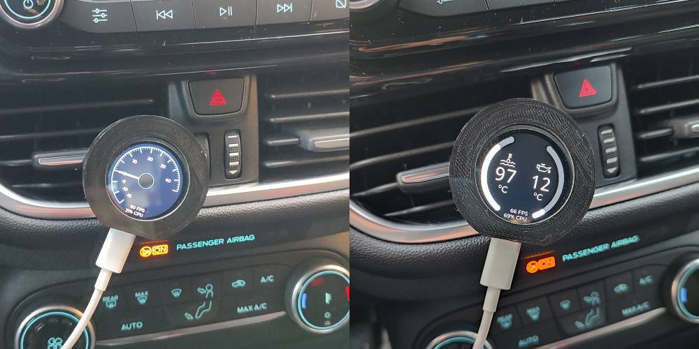

# Car gauge using BLE and LVGL

Boost pressure car gauge and water, oil levels indicator. The datas are retrieved from the car using via BLE from the OBD2 port and they are displayed on a ESP32-S3 touch display with LVGL library.

# Photo

## Links

- Display: [Aliexpress ESP32 Display](https://it.aliexpress.com/item/1005006169531322.html?spm=a2g0o.order_list.order_list_main.77.34513696xiTFVr&gatewayAdapt=glo2ita)
- OBD2: [Aliexpress OBD2](https://it.aliexpress.com/item/32951258002.html?spm=a2g0o.order_list.order_list_main.169.34513696xiTFVr&gatewayAdapt=glo2ita)
